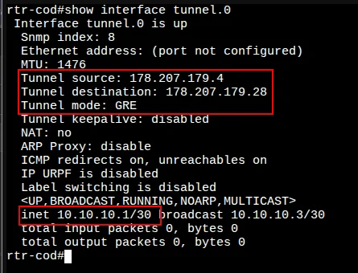
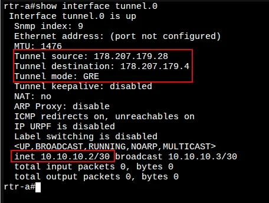
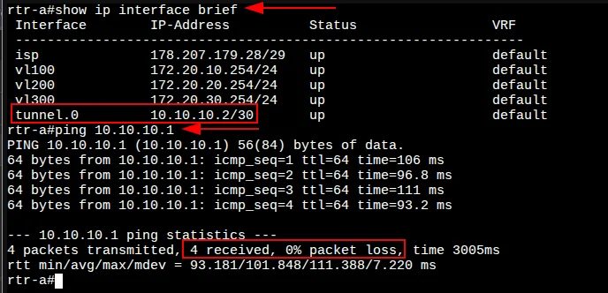

# 4. Настройка туннелей между офисом «a» и «cod»

[← Вернуться к оглавлению](../README.md) | [← Предыдущий модуль](03-bgp-config.md) | [Следующий модуль →](05-nat-config.md)

---

## Содержание

- [Обзор](#обзор)
- [cod (EcoRouter)](#rtr-cod-ecorouter)
- [a (EcoRouter)](#rtr-a-ecorouter)
- [Проверка связности](#проверка-связности)


## cod (EcoRouter)

### Настройка туннеля GRE

#### Шаг 1: Создание интерфейса туннеля

Создайте интерфейс туннеля с именем `tunnel.0`:

```
cod(config)#interface tunnel.0
cod(config-if-tunnel)#
```

#### Шаг 2: Назначение IP-адреса

Назначьте IP-адрес я буду использовать 10.10.10.0/24

```
cod(config-if-tunnel)#ip address 10.10.10.1/24
cod(config-if-tunnel)#
```

#### Шаг 3: Настройка параметров туннеля

Задайте режим работы туннеля GRE и адреса источника (cod) и назначения (a):

```
cod(config-if-tunnel)#ip tunnel адреса провайдеров mode gre
cod(config-if-tunnel)#exit
cod(config)#write memory
Building configuration...
```

#### Проверка туннеля на cod

Для просмотра состояния туннеля используется команда `show interface tunnel.0`:



---

## a (EcoRouter)

### Настройка туннеля GRE

Реализация аналогична cod, но с зеркальными адресами источника и назначения.

#### Шаг 1: Создание интерфейса туннеля

```
a(config)#interface tunnel.0
a(config-if-tunnel)#
```

#### Шаг 2: Назначение IP-адреса

```
a(config-if-tunnel)#ip address 10.10.10.2/30
a(config-if-tunnel)#
```

#### Шаг 3: Настройка параметров туннеля

> 

```
a(config-if-tunnel)#ip tunnel адреса провайдеров mode gre
a(config-if-tunnel)#exit
a(config)#write memory
Building configuration...
```

#### Проверка туннеля на a




---

## Проверка связности

### Проверка интерфейсов и ping через туннель




Проверка связности с противоположным концом туннеля:

```
a#ping 10.10.10.1
PING 10.10.10.1 (10.10.10.1) 56(84) bytes of data.
64 bytes from 10.10.10.1: icmp_seq=1 ttl=64 time=106 ms
64 bytes from 10.10.10.1: icmp_seq=2 ttl=64 time=96.8 ms
64 bytes from 10.10.10.1: icmp_seq=3 ttl=64 time=111 ms
64 bytes from 10.10.10.1: icmp_seq=4 ttl=64 time=93.2 ms

--- 10.10.10.1 ping statistics ---
4 packets transmitted, 4 received, 0% packet loss
```


---


[← Вернуться к оглавлению](../README.md) | [← Предыдущий модуль](03-bgp-config.md) | [Следующий модуль →](05-nat-config.md)
