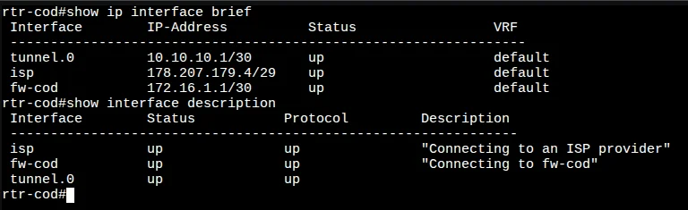
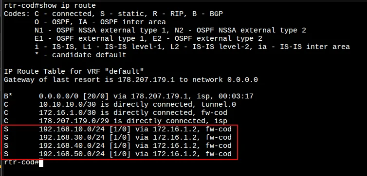
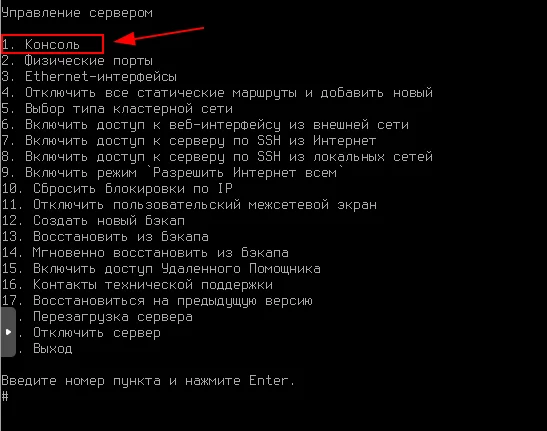
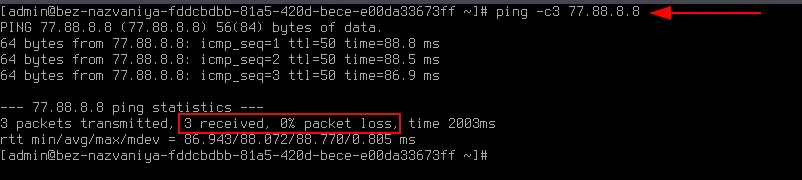
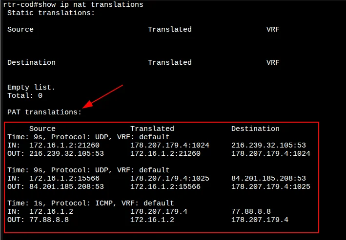
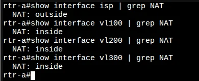
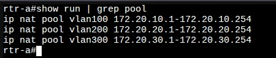
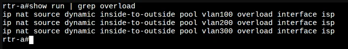
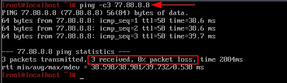
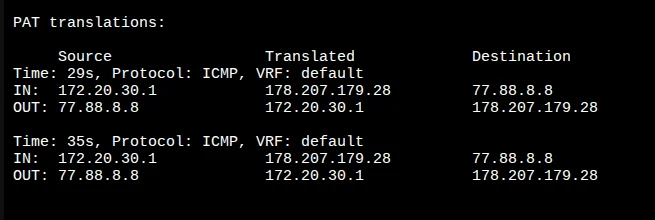

# 5. Настройка доступа в Интернет

[← Вернуться к оглавлению](../README.md) | [← Предыдущий модуль](04-tunnel-config.md) | [Следующий модуль →](06-ospf-config.md)

---

## Содержание

- [Обзор](#обзор)
- [cod (EcoRouter)](#rtr-cod-ecorouter)
  - [Настройка dynamic PAT](#настройка-dynamic-pat)
  - [Статические маршруты](#статические-маршруты)
  - [Проверка NAT](#проверка-nat)
- [a (EcoRouter)](#rtr-a-ecorouter)
  - [Настройка dynamic PAT](#настройка-dynamic-pat-1)
  - [Проверка NAT](#проверка-nat-1)

---

## Обзор

Для обеспечения доступа в Интернет из локальных сетей необходимо настроить динамическую трансляцию адресов (PAT/NAT overload) на маршрутизаторах 

---

## cod (EcoRouter)

### Настройка dynamic PAT

#### Шаг 1: Определение inside/outside интерфейсов

С точки зрения NAT:
- **outside** — интерфейс `internet` (в сторону Интернета)
- **inside** — интерфейс `firewall` (в сторону локальной сети)



Назначаем интерфейс `internet` как **outside**:

```
cod(config)#interface internet 
cod(config-if)#ip nat outside 
cod(config-if)#exit
```

Назначаем интерфейс `firewall` как **inside**:

```
cod(config)#interface firewall
cod(config-if)#ip nat inside 
cod(config-if)#exit
```

---

#### Шаг 2: Создание NAT pool

Создаём NAT pool для указания диапазонов IP-адресов, которые будут попадать под правила трансляции.
использую диапазоны 192.168.х.1-254

>

```
cod(config)#ip nat pool firewall 172.16.1.1-172.16.1.2
cod(config)#ip nat pool vlan100 диапазон
cod(config)#ip nat pool vlan300 диапазон
cod(config)#ip nat pool vlan400 диапазон
cod(config)#ip nat pool vlan500 диапазон
```

---

#### Шаг 3: Создание правил трансляции

Создаём правила трансляции адресов для каждого NAT pool через outside-интерфейс:

```
cod(config)#ip nat source dynamic inside pool firewall overload interface internet 
cod(config)#ip nat source dynamic inside pool vlan100 overload interface internet
cod(config)#ip nat source dynamic inside pool vlan300 overload interface internet 
cod(config)#ip nat source dynamic inside pool vlan400 overload interface internet 
cod(config)#ip nat source dynamic inside pool vlan500 overload interface internet 
cod(config)#write memory
Building configuration...
```

---

### Статические маршруты

Добавляем статические маршруты в локальные сети COD:


```
cod(config)#ip route адрес 172.16.1.2
cod(config)#ip route адрес 172.16.1.2
cod(config)#ip route адрес 172.16.1.2
cod(config)#ip route адрес 172.16.1.2
cod(config)#write memory
Building configuration...
```

#### Проверка таблицы маршрутизации



---

### Проверка NAT

#### Проверка доступа в Интернет с firewall

Для проверки используем консоль Ideco (пункт меню **1. Консоль**):



**Временно** назначаем адрес шлюза по умолчанию:

```bash
ip route add 0.0.0.0/0 via 172.16.1.1
```

Проверяем доступ в Интернет:



```
ping -c3 77.88.8.8
3 packets transmitted, 3 received, 0% packet loss
```

#### Проверка таблицы трансляции

На cod проверяем таблицу трансляции командой `show ip nat translations`:




---

## a (EcoRouter)

### Настройка dynamic PAT

#### Шаг 1: Определение inside/outside интерфейсов

С точки зрения NAT:
- **outside** — интерфейс `internet`
- **inside** — интерфейсы `vl100`, `vl200`, `vl300`

```
a(config)#interface internet 
a(config-if)#ip nat outside 
a(config-if)#exit
a(config)#
```

```
a(config)#interface vl100
a(config-if)#ip nat inside 
a(config-if)#exit
a(config)#
```

```
a(config)#interface vl200
a(config-if)#ip nat inside 
a(config-if)#exit
a(config)#
```

```
a(config)#interface vl300
a(config-if)#ip nat inside 
a(config-if)#exit
a(config)#
```

#### Проверка NAT-интерфейсов



---

#### Шаг 2: Создание NAT pool

```
a(config)#ip nat pool vlan100 172.20.x.1-172.20.x.254
a(config)#ip nat pool vlan200 172.20.x.1-172.20.x.254
a(config)#ip nat pool vlan300 172.20.x.1-172.20.x.254
a(config)#
```



---

#### Шаг 3: Создание правил трансляции

```
a(config)#ip nat source dynamic inside-to-outside pool vlan100 overload interface internet
a(config)#ip nat source dynamic inside-to-outside pool vlan200 overload interface internet
a(config)#ip nat source dynamic inside-to-outside pool vlan300 overload interface internet
a(config)#write memory
Building configuration...
```



---

### Проверка NAT

#### Проверка доступа в Интернет с switch1-a

Для проверки на switch1-a временно создаём тегированный подинтерфейс с IP-адресом из VLAN 300 к примеру:

```bash
ip link add link ens19 name ens19.300 type vlan id 300
ip link set dev ens19.300 up
ip addr add 172.20.30.1/24 dev ens19.300
ip route add 0.0.0.0/0 via 172.20.30.254
```

Проверяем доступ в Интернет:



```
ping -c3 77.88.8.8
3 packets transmitted, 3 received, 0% packet loss
```

#### Проверка таблицы трансляции

На a проверяем таблицу трансляции командой `show ip nat translations`:



---

[← Вернуться к оглавлению](../README.md) | [← Предыдущий модуль](04-tunnel-config.md) | [Следующий модуль →](06-ospf-config.md)
