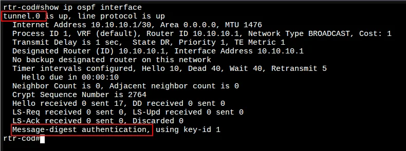
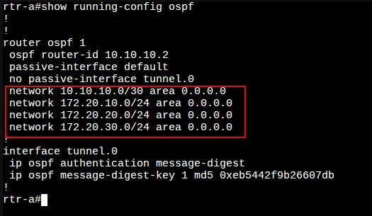
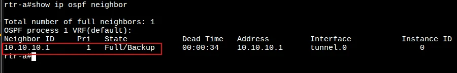
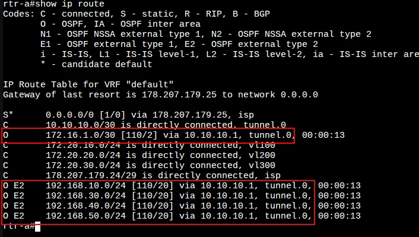
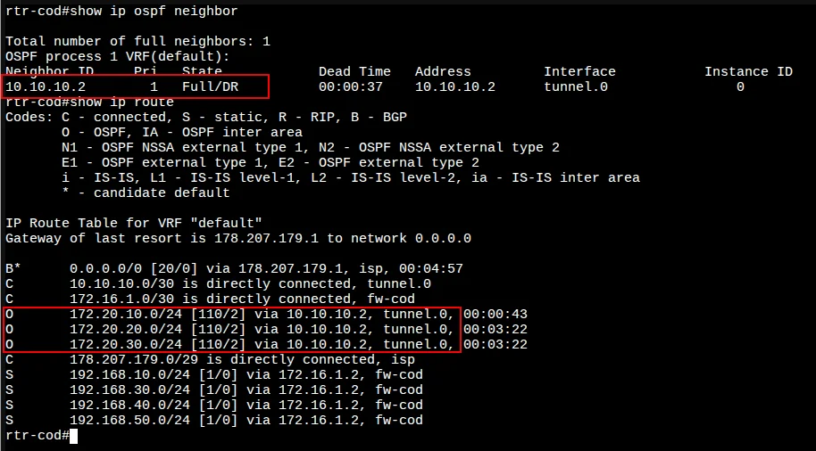
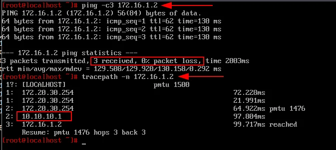

# 6. Настройка динамической маршрутизации между офисом «a» и «cod»

[← Вернуться к оглавлению](../README.md) | [← Предыдущий модуль](05-nat-config.md) | [Следующий модуль →](07-switching-config.md)

---

## Содержание

- [Обзор](#обзор)
- [cod (EcoRouter)](#rtr-cod-ecorouter)
- [a (EcoRouter)](#rtr-a-ecorouter)
- [Проверка OSPF](#проверка-ospf)

---

## cod (EcoRouter)

### Настройка динамической маршрутизации OSPF

#### Шаг 1: Запуск процесса OSPF

Перейдите в режим конфигурирования протокола:

```
cod(config)#router ospf 1
cod(config-router)#
```

#### Шаг 2: Настройка Router ID

Сконфигурируйте OSPF идентификатор маршрутизатора (используем туннельный IP-адрес):

```
cod(config-router)#router-id 10.10.10.1
cod(config-router)#
```

#### Шаг 3: Настройка пассивных интерфейсов

Переводим все интерфейсы в пассивный режим:

```
cod(config-router)#passive-interface default 
cod(config-router)#
```

Исключаем интерфейс `tunnel.0` из пассивного режима для установления соседства:

```
rtr-cod(config-router)#no passive-interface tunnel.0 
rtr-cod(config-router)#
```

#### Шаг 4: Объявление сетей

Объявляем сети и импортируем статические маршруты:

```
cod(config-router)#redistribute static 
cod(config-router)#network 10.10.10.0/30 area 0
cod(config-router)#network 172.16.1.0/30 area 0
cod(config-router)#exit
cod(config)#
```


#### Шаг 5: Настройка аутентификации

Обеспечиваем защиту протокола маршрутизации посредством MD5-аутентификации:

```
cod(config)#interface tunnel.0
cod(config-if-tunnel)#ip ospf authentication message-digest 
cod(config-if-tunnel)#ip ospf message-digest-key 1 md5 P@ssw0rd
cod(config-if-tunnel)#exit
cod(config)#write memory
Building configuration...

cod(config)#
```

#### Проверка OSPF на интерфейсе

Просмотр данных о состоянии интерфейсов OSPF командой `show ip ospf interface`:



**Ключевые параметры:**
- `tunnel.0 is up, line protocol is up` — интерфейс активен
- `Area 0.0.0.0` — область OSPF
- `Message-digest authentication, using key-id 1` — MD5-аутентификация включена

---

## a (EcoRouter)

### Настройка динамической маршрутизации OSPF

#### Шаг 1: Запуск процесса OSPF

```
a(config)#router ospf 1
a(config-router)#
```

#### Шаг 2: Настройка Router ID

```
a(config-router)#router-id 10.10.10.2
a(config-router)#
```

#### Шаг 3: Настройка пассивных интерфейсов

```
a(config-router)#passive-interface default 
a(config-router)#no passive-interface tunnel.0 
a(config-router)#
```

#### Шаг 4: Объявление сетей

На rtr-a объявляем сети туннеля и локальных VLAN:

```
a(config-router)#network 10.10.10.0/30 area 0
a(config-router)#network 172.20.x.0/24 area 0
a(config-router)#network 172.20.x.0/24 area 0
a(config-router)#network 172.20.x.0/24 area 0
a(config-router)#exit
a(config)#
```
#### Шаг 5: Настройка аутентификации

```
a(config)#interface tunnel.0
a(config-if-tunnel)#ip ospf authentication message-digest 
a(config-if-tunnel)#ip ospf message-digest-key 1 md5 P@ssw0rd
a(config-if-tunnel)#exit
a(config)#write memory
Building configuration...
a(config)#
```

#### Проверка конфигурации OSPF



---

## Проверка OSPF

### Проверка соседства на rtr-a

Команда `show ip ospf neighbor`:



### Проверка таблицы маршрутизации на a

Команда `show ip route`:



Маршруты, полученные по OSPF (помечены `O` и `O E2`):

### Проверка соседства и маршрутов на cod

Команды `show ip ospf neighbor` и `show ip route`:




Маршруты, полученные по OSPF:


### Проверка связности между площадками

Проверка связности между switch1-a и firewall (при наличии временных маршрутов):




---


[← Вернуться к оглавлению](../README.md) | [← Предыдущий модуль](05-nat-config.md) | [Следующий модуль →](07-switching-config.md)
