# 7. Настройка коммутации между switch1-a и switch2-a

[← Вернуться к оглавлению](../README.md) | [← Предыдущий модуль](06-ospf-config.md) | [Следующий модуль →](08-fwcod-web-config.md)

---

## Содержание

- [Обзор](#обзор)
- [switch1-a (Alt Server)](#sw1-a-alt-server)
  - [Назначение имени](#назначение-имени)
  - [Установка Open vSwitch](#установка-open-vswitch)
  - [Настройка коммутации](#настройка-коммутации)
  - [Настройка RSTP](#настройка-rstp)
  - [Настройка Management интерфейса](#настройка-management-интерфейса)
- [switch2-a (Alt Server)](#sw2-a-alt-server)
  - [Назначение имени](#назначение-имени-1)
  - [Установка Open vSwitch](#установка-open-vswitch-1)
  - [Настройка коммутации](#настройка-коммутации-1)
  - [Настройка RSTP](#настройка-rstp-1)
  - [Настройка Management интерфейса](#настройка-management-интерфейса-1)

---


## switch1-a (Alt Server)

### Назначение имени

Назначаем имя устройства согласно топологии:

```bash
hostnamectl set-hostname имя устройства; exec bash
```

Также рекомендуется указать имя в файле `/etc/sysconfig/network`:

```bash
vim /etc/sysconfig/network
```

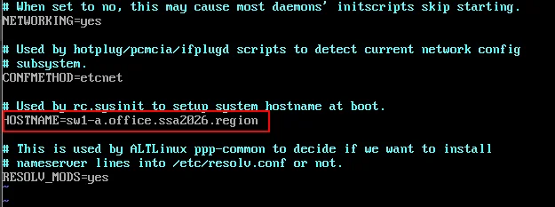

Проверка имени:

```bash
hostname -f
```

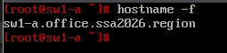

---

### Установка Open vSwitch

#### Временная настройка сети для установки пакетов

Для установки пакета openvswitch необходим доступ в Интернет:

```bash
ip link add link ens19 name ens19.300 type vlan id 300
ip link set dev ens19.300 up
ip addr add 172.20.х.1/24 dev ens19.300
ip route add 0.0.0.0/0 via 172.20.х.254
echo "nameserver 77.88.8.8" > /etc/resolv.conf
```

#### Установка и настройка Open vSwitch

Обновляем список пакетов и устанавливаем openvswitch:

```bash
apt-get update && apt-get install -y openvswitch
```

Включаем и добавляем в автозагрузку:

```bash
systemctl enable --now openvswitch
```

Отключаем автоудаление настроек OVS:

```bash
sed -i "s/OVS_REMOVE=yes/OVS_REMOVE=no/g" /etc/net/ifaces/default/options
```

Перезагружаем сервер:

```bash
reboot
```

#### Настройка физических интерфейсов

Проверяем интерфейсы:

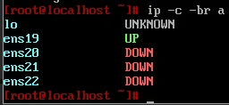

Поднимаем физические интерфейсы через etcnet:

```bash
cp -r /etc/net/ifaces/ens19 /etc/net/ifaces/ens20
cp -r /etc/net/ifaces/ens19 /etc/net/ifaces/ens21
cp -r /etc/net/ifaces/ens19 /etc/net/ifaces/ens22
```

Перезагружаем службу network:

```bash
systemctl restart network
```

Проверяем, что интерфейсы в статусе UP:

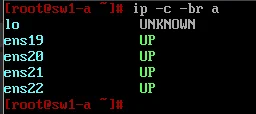

#### Временный коммутатор для switch2-a

Создаём временный коммутатор для установки OVS на switch2-a:

```bash
ovs-vsctl add-br br0
ovs-vsctl add-port br0 ens19
ovs-vsctl add-port br0 ens21
```

---

### Настройка коммутации

#### Удаление временного коммутатора

```bash
ovs-vsctl del-br br0
```

#### Создание основного коммутатора

```bash
ovs-vsctl add-br switch1-a
```

Проверка создания:

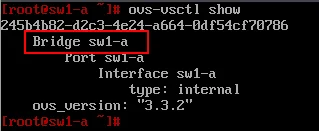

#### Настройка портов

**Access порт в сторону dcserv-a (VLAN 100):**

```bash
ovs-vsctl add-port switch1-a ens20 tag=100
```

**Trunk порт в сторону a:**

```bash
ovs-vsctl add-port switch1-a ens19 trunk=100,200,300
```

**Trunk порты в сторону switch2-a:**

```bash
ovs-vsctl add-port switch1-a ens21 trunk=100,200,300
ovs-vsctl add-port switch1-a ens22 trunk=100,200,300
```

Проверка портов:

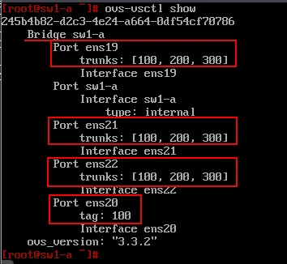

#### Включение модуля 802.1Q

```bash
modprobe 8021q
echo "8021q" | tee -a /etc/modules
```

---

### Настройка RSTP

Включаем RSTP на коммутаторе:

```bash
ovs-vsctl set bridge sw1-a rstp_enable=true
ovs-vsctl set bridge sw1-a other_config:stp-protocol=rstp
```

Задаём наименьший приоритет (Root Bridge):

```bash
ovs-vsctl set bridge sw1-a other_config:rstp-priority=0
```

Проверка RSTP:

```bash
ovs-appctl rstp/show
```

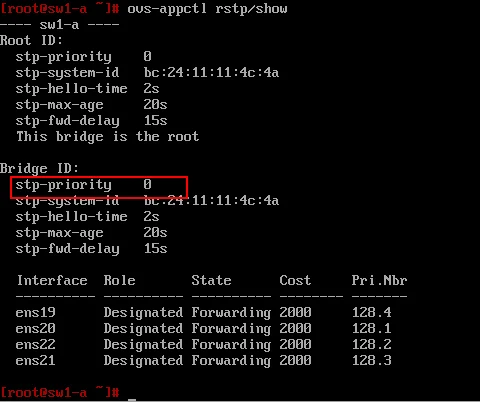

Проверка настроек bridge:

```bash
ovs-vsctl list bridge
```

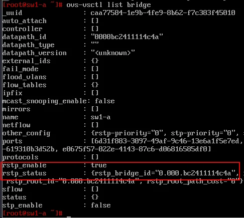

---

### Настройка Management интерфейса

#### Создание каталога и файла options

```bash
mkdir /etc/net/ifaces/mgmt
nano /etc/net/ifaces/mgmt/options
```

Содержимое файла options:

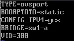

```
TYPE=ovsport
BOOTPROTO=static
CONFIG_IPV4=yes
BRIDGE=switch1-a
VID=300
```


#### Назначение IP-адреса и маршрута

```bash
echo "172.20.x.1/24" > /etc/net/ifaces/mgmt/ipv4address
echo "default via 172.20.x.254" > /etc/net/ifaces/mgmt/ipv4route
```

Применяем настройки:

```bash
systemctl restart network
```

#### Проверка настроек

Проверка IP-адреса:

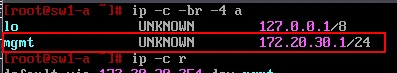

Проверка маршрута:

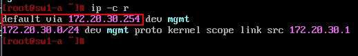

Проверка в OVS:

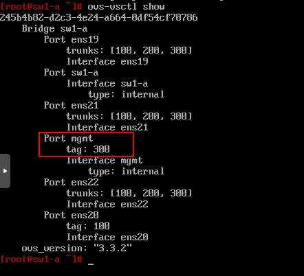

#### Настройка Native VLAN

```bash
ovs-vsctl set port mgmt vlan_mode=native-untagged
```

Проверка:

```bash
ovs-vsctl list port mgmt
```

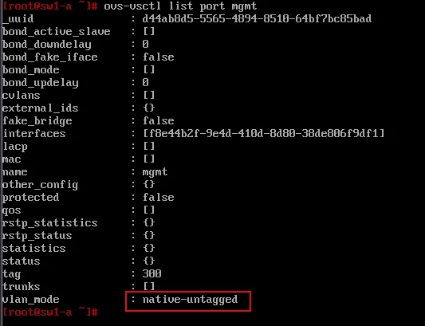

---

## switch2-a (Alt Server)

### Назначение имени

```bash
hostnamectl set-hostname switch2-a.(domain); exec bash
```

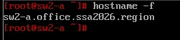

---

### Установка Open vSwitch

#### Временная настройка сети

```bash
ip link add link ens19 name ens19.300 type vlan id 300
ip link set dev ens19.300 up
ip addr add 172.20.x.2/24 dev ens19.300
ip route add 0.0.0.0/0 via 172.20.x.254
echo "nameserver 77.88.8.8" > /etc/resolv.conf
```

#### Установка пакета

```bash
apt-get update && apt-get install -y openvswitch
systemctl enable --now openvswitch
sed -i "s/OVS_REMOVE=yes/OVS_REMOVE=no/g" /etc/net/ifaces/default/options
reboot
```

#### Настройка физических интерфейсов

Проверка интерфейсов (до):

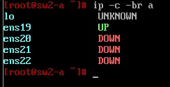

```bash
cp -r /etc/net/ifaces/ens19 /etc/net/ifaces/ens20
cp -r /etc/net/ifaces/ens19 /etc/net/ifaces/ens21
cp -r /etc/net/ifaces/ens19 /etc/net/ifaces/ens22
systemctl restart network
```

Проверка интерфейсов (после):

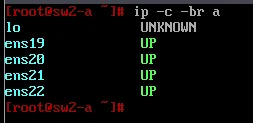

---

### Настройка коммутации

#### Создание коммутатора

```bash
ovs-vsctl add-br switch2-a
```

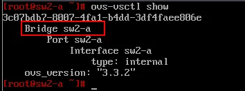

#### Настройка портов

**Access порты в сторону клиентов (VLAN 200):**

```bash
ovs-vsctl add-port switch2-a ens22 tag=200
ovs-vsctl add-port switch2-a ens21 tag=200
```

**Trunk порты в сторону switch1-a:**

```bash
ovs-vsctl add-port switch2-a ens19 trunk=100,200,300
ovs-vsctl add-port switch2-a ens20 trunk=100,200,300
```

Проверка портов:

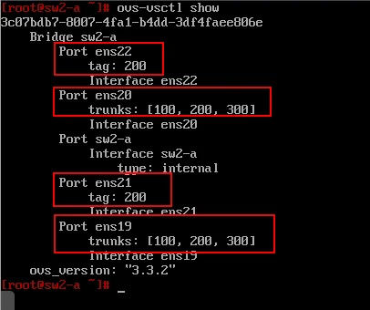

#### Включение модуля 802.1Q

```bash
modprobe 8021q
echo "8021q" | tee -a /etc/modules
```

---

### Настройка RSTP

```bash
ovs-vsctl set bridge switch2-a rstp_enable=true
ovs-vsctl set bridge switch2-a other_config:stp-protocol=rstp
```


Проверка RSTP:

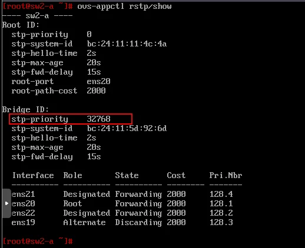

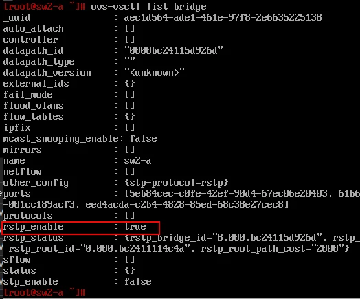

---

### Настройка Management интерфейса

```bash
mkdir /etc/net/ifaces/mgmt
nano /etc/net/ifaces/mgmt/options
```

Содержимое файла options:

```
TYPE=ovsport
BOOTPROTO=static
CONFIG_IPV4=yes
BRIDGE=switch2-a
VID=300
```

Назначение IP-адреса и маршрута:

```bash
echo "172.20.x.2/24" > /etc/net/ifaces/mgmt/ipv4address
echo "default via 172.20.x.254" > /etc/net/ifaces/mgmt/ipv4route
systemctl restart network
```

Настройка Native VLAN:

```bash
ovs-vsctl set port mgmt vlan_mode=native-untagged
```

---

## Итоговая конфигурация

### sw1-a

```bash
# Коммутатор
ovs-vsctl add-br switch1-a

# Порты
ovs-vsctl add-port switch1-a ens19 trunk=100,200,300
ovs-vsctl add-port switch1-a ens20 tag=100
ovs-vsctl add-port switch1-a ens21 trunk=100,200,300
ovs-vsctl add-port switch1-a ens22 trunk=100,200,300

# RSTP (Root Bridge)
ovs-vsctl set bridge switch1-a rstp_enable=true
ovs-vsctl set bridge switch1-a other_config:stp-protocol=rstp
ovs-vsctl set bridge switch1-a other_config:rstp-priority=0

# Management
ovs-vsctl set port mgmt vlan_mode=native-untagged
```

### switch2-a

```bash
# Коммутатор
ovs-vsctl add-br switch2-a

# Порты
ovs-vsctl add-port switch2-a ens19 trunk=100,200,300
ovs-vsctl add-port switch2-a ens20 trunk=100,200,300
ovs-vsctl add-port switch2-a ens21 tag=200
ovs-vsctl add-port switch2-a ens22 tag=200

# RSTP
ovs-vsctl set bridge switch2-a rstp_enable=true
ovs-vsctl set bridge switch2-a other_config:stp-protocol=rstp

# Management
ovs-vsctl set port mgmt vlan_mode=native-untagged
```

---

## Проверка связности

### Проверка Native VLAN на sw2-a

```bash
ovs-vsctl list port mgmt
```

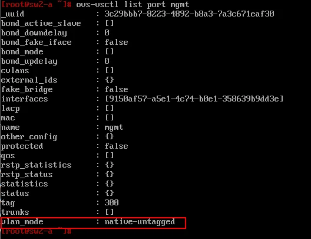

### Проверка доступности коммутаторов

#### С маршрутизатора a

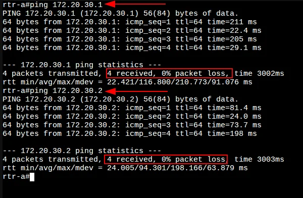

```
a#ping 172.20.x.1
4 packets transmitted, 4 received, 0% packet loss

a#ping 172.20.x.2
4 packets transmitted, 4 received, 0% packet loss
```
#### С маршрутизатора cod (через туннель)

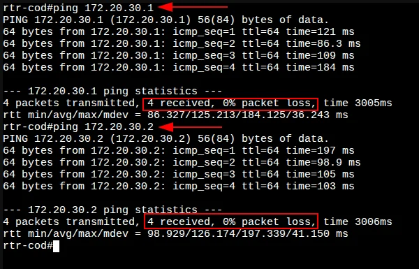

```
rtr-cod#ping 172.20.x.1
4 packets transmitted, 4 received, 0% packet loss

rtr-cod#ping 172.20.x.2
4 packets transmitted, 4 received, 0% packet loss
```


### Проверка доступа в Интернет с коммутаторов


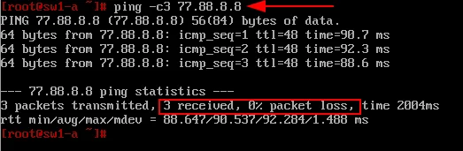

```
ping -c3 77.88.8.8
3 packets transmitted, 3 received, 0% packet loss
```


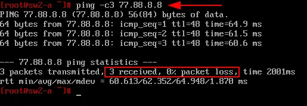

```
ping -c3 77.88.8.8
3 packets transmitted, 3 received, 0% packet loss
```


---

[← Вернуться к оглавлению](../README.md) | [← Предыдущий модуль](06-ospf-config.md) | [Следующий модуль →](08-fwcod-web-config.md)
