# 11. Настройка имён и IP-адресов на всех остальных устройствах

[← Вернуться к оглавлению](../README.md) | [← Предыдущий модуль](10-switching-cod-config.md) | [Следующий модуль →](12-next-config.md)
---

## cli-cod (Альт Рабочая станция)

### Назначение имени устройства

Откройте **Центр управления системой** (ЦУС/ACC):

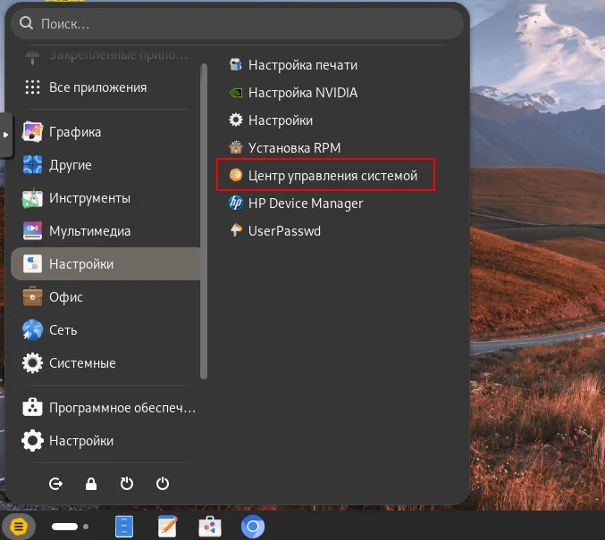

Перейдите в раздел **Сеть → Ethernet-интерфейсы**:

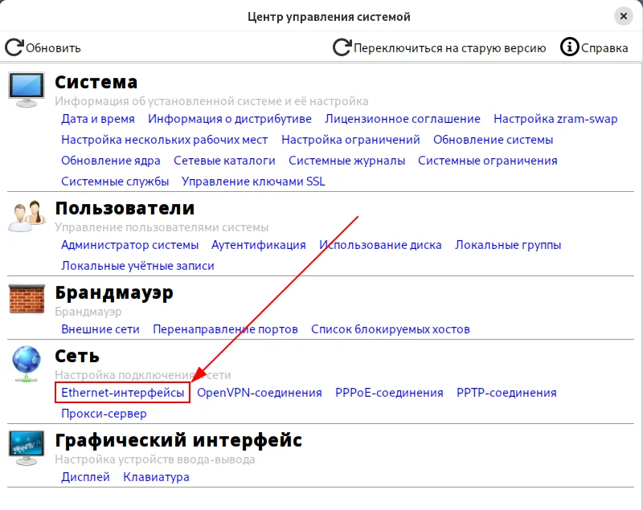

Укажите имя компьютера `client-cod.domain` и нажмите **Применить**:

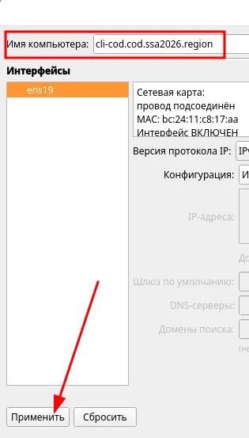

### Настройка сетевой подсистемы

В качестве режима работы сетевой подсистемы выберите **NetworkManager (native)**:

1. Нажмите кнопку **Дополнительно**
2. Выберите **NetworkManager (native)**
3. Нажмите **OK**
4. Нажмите **Применить**

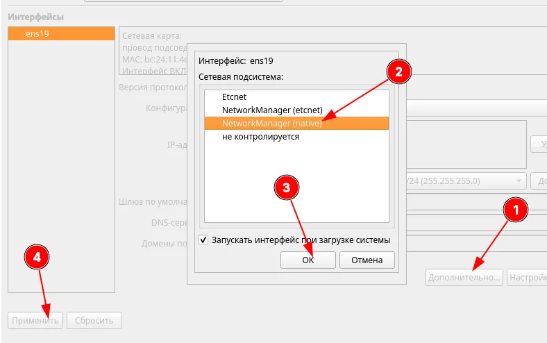

### Настройка сетевых параметров

Откройте стандартные **Настройки**:

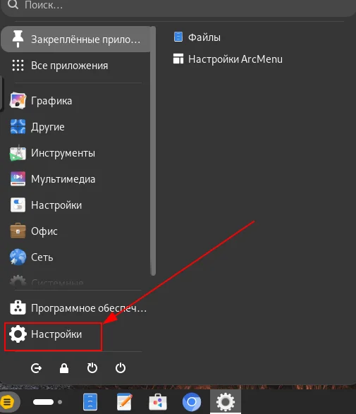

Перейдите в раздел **Сеть** и нажмите на шестерёнку рядом с подключением:

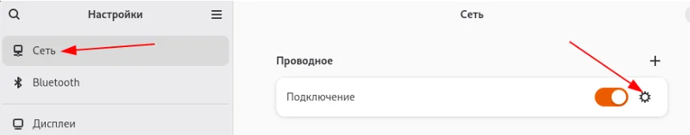

На вкладке **Подробности** проверьте настройки:

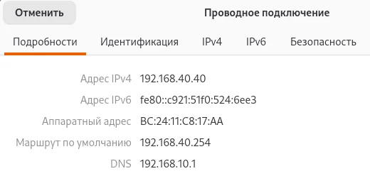

| Параметр | Значение |
|----------|----------|
| Адрес IPv4 | 192.168.чx.40 |
| Маршрут по умолчанию | 192.168.40.254 |
| DNS | 192.168.10.1 |

### Проверка доступа в Интернет

```bash
ping -c3 77.88.8.8
```

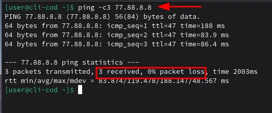


---

## client2-a (Альт Рабочая станция)

### Базовая настройка

Настройка выполняется аналогично cli-cod через **Центр управления системой** и **Настройки**.

Проверьте имя устройства:

```bash
hostname -f
```

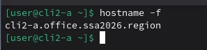

✅ Имя: `client2-a.domain`

### Сетевые параметры

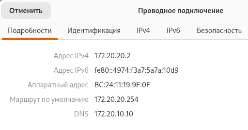

| Параметр | Значение |
|----------|----------|
| Адрес IPv4 | 172.20.20.2 |
| Маршрут по умолчанию | 172.20.20.254 |
| DNS | 172.20.10.10 |

### Проверка доступа в Интернет

```bash
ping -c3 77.88.8.8
```

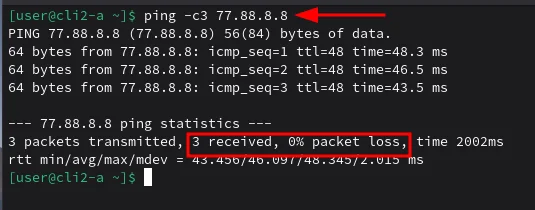

### Проверка связности с офисом COD

```bash
ping -c3 192.168.40.40
tracepath -n 192.168.40.40
```

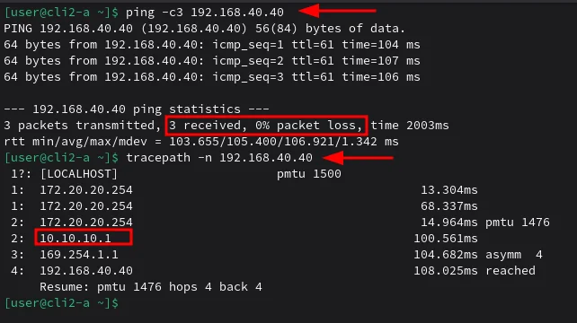

---

## admin-cod (Альт Рабочая станция)

### Базовая настройка

Настройка выполняется аналогично cli-cod через **Центр управления системой** и **Настройки**.

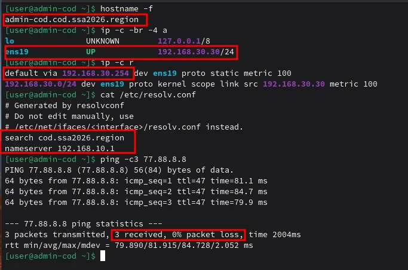

| Параметр | Значение |
|----------|----------|
| Hostname | admin-cod.domain |
| IP-адрес | 192.168.30.30/24 |
| Шлюз | 192.168.30.254 |
| DNS | 192.168.10.1 |
| Домен поиска | domain |

### Проверка

```bash
hostname -f
ip -c -br -4 a
ip -c r
cat /etc/resolv.conf
ping -c3 77.88.8.8
```
---

## srvs1-cod (Альт Сервер)

### Назначение имени устройства

```bash
hostnamectl set-hostname srvs1-cod.domain; exec bash
```

Также укажите имя в файле `/etc/sysconfig/network`:

```bash
vim /etc/sysconfig/network
```

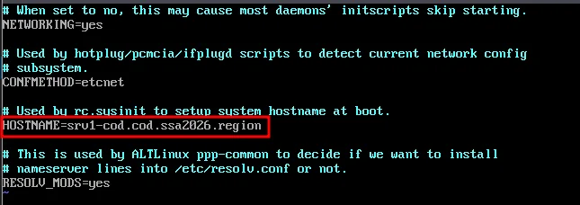

Укажите параметр `HOSTNAME`:

```
HOSTNAME=srvs1-cod.domain
```

Проверьте результат:

```bash
hostname -f
```

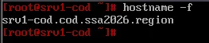


### Определение интерфейсов

Проверьте интерфейсы (сверка по MAC-адресам):

```bash
ip -c -br a
```

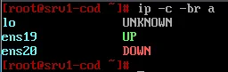

В данном примере:
- `ens19` — интерфейс в сторону switch1-cod (VLAN 100)
- `ens20` — интерфейс в сторону switch1-cod (VLAN 200)

### Настройка интерфейсов

Создайте директории и файлы `options` для каждого интерфейса:

```bash
mkdir -p /etc/net/ifaces/{ens19,ens20}

cat > /etc/net/ifaces/ens19/options << EOF
TYPE=eth
BOOTPROTO=static
EOF

cat > /etc/net/ifaces/ens20/options << EOF
TYPE=eth
BOOTPROTO=static
EOF
```

Проверьте содержимое:

```bash
ls /etc/net/ifaces/
cat /etc/net/ifaces/ens19/options
cat /etc/net/ifaces/ens20/options
```

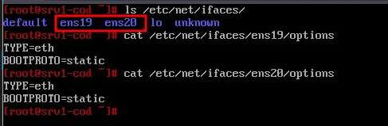

### Назначение IP-адресов

Задайте IP-адрес на интерфейс ens19 (VLAN 100):

```bash
echo "192.168.x.1/24" > /etc/net/ifaces/ens19/ipv4address
```

Задайте шлюз по умолчанию для интерфейса ens19:

```bash
echo "default via 192.168.x.254" > /etc/net/ifaces/ens19/ipv4route
```

Задайте IP-адрес на интерфейс ens20 (VLAN 200):

```bash
echo "192.168.x.1/24" > /etc/net/ifaces/ens20/ipv4address
```

> 

Перезагрузите службу network:

```bash
systemctl restart network
```

### Проверка конфигурации

```bash
ip -c -br -4 a
ip -c r
ping -c3 77.88.8.8
```

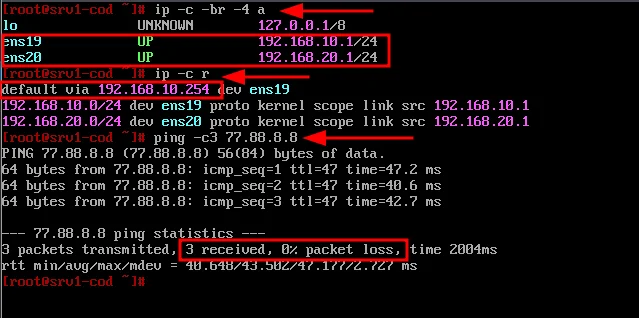

| Интерфейс | VLAN | IP-адрес | Шлюз |
|-----------|------|----------|------|
| ens19 | 100 | 192.168.10.1/24 | 192.168.10.254 |
| ens20 | 200 | 192.168.20.1/24 | — |

✅ Доступ в Интернет работает (3 received, 0% packet loss).

---

## srvs2-cod (Альт Сервер)

### Базовая настройка

Настройка выполняется аналогично srvs1-cod.

```bash
hostnamectl set-hostname srvs2-cod.domain; exec bash
```

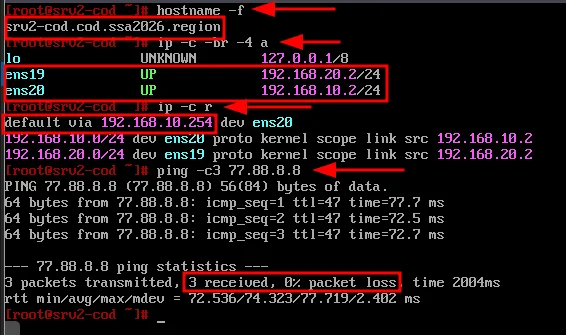

| Параметр | Значение |
|----------|----------|
| Hostname | srv2-cod.domain |
| ens19 (VLAN 200) | 192.168.x.2/24 |
| ens20 (VLAN 100) | 192.168.x.2/24 |
| Шлюз | 192.168.10.254 (через ens20) |

### Настройка интерфейсов

```bash
mkdir -p /etc/net/ifaces/{ens19,ens20}

# ens19 - VLAN 200
cat > /etc/net/ifaces/ens19/options << EOF
TYPE=eth
BOOTPROTO=static
EOF
echo "192.168.x.2/24" > /etc/net/ifaces/ens19/ipv4address

# ens20 - VLAN 100
cat > /etc/net/ifaces/ens20/options << EOF
TYPE=eth
BOOTPROTO=static
EOF
echo "192.168.x.2/24" > /etc/net/ifaces/ens20/ipv4address
echo "default via 192.168.10.254" > /etc/net/ifaces/ens20/ipv4route

systemctl restart network
```


---

## dcserv-a (Альт Сервер)

### Базовая настройка

Настройка выполняется аналогично srvs1-cod.

```bash
hostnamectl set-hostname dcserv-a.domain; exec bash
```

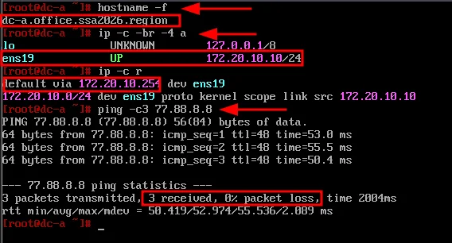

| Параметр | Значение |
|----------|----------|
| Hostname | dc-a.office.ssa2026.region |
| ens19 (VLAN 100) | 172.20.10.10/24 |
| Шлюз | 172.20.10.254 |

### Настройка интерфейса

```bash
mkdir -p /etc/net/ifaces/ens19

cat > /etc/net/ifaces/ens19/options << EOF
TYPE=eth
BOOTPROTO=static
EOF

echo "172.20.10.10/24" > /etc/net/ifaces/ens19/ipv4address
echo "default via 172.20.10.254" > /etc/net/ifaces/ens19/ipv4route

systemctl restart network
```

### Проверка

```bash
hostname -f
ip -c -br -4 a
ip -c r
ping -c3 77.88.8.8
```
---

[← Вернуться к оглавлению](../README.md) | [← Предыдущий модуль](10-switching-cod-config.md) | [Следующий модуль →](12-next-config.md)
