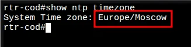
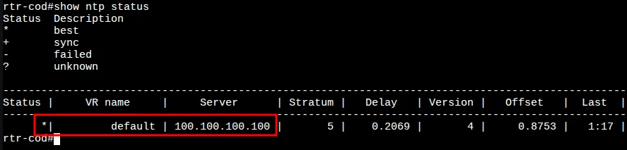
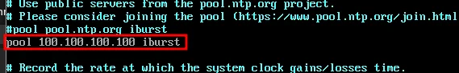
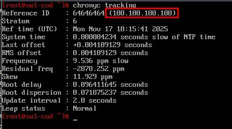
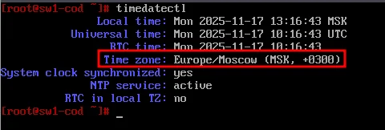
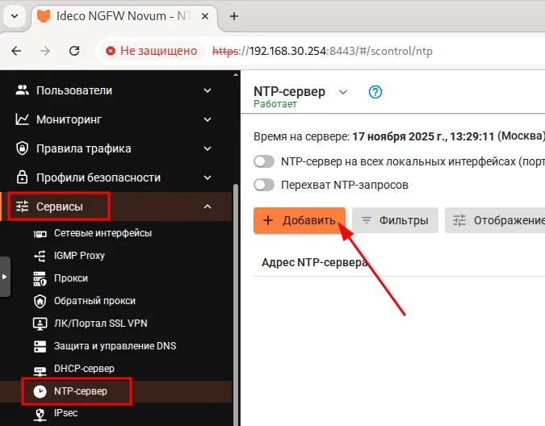
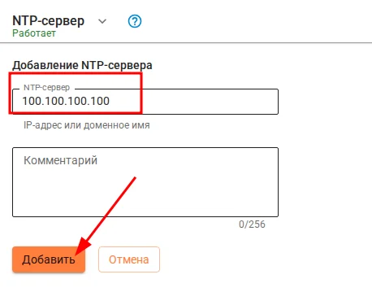
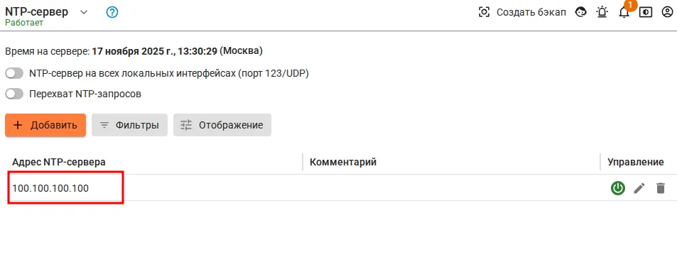
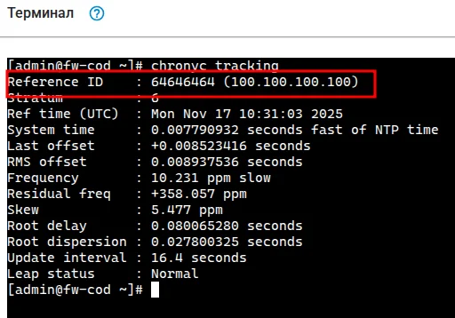
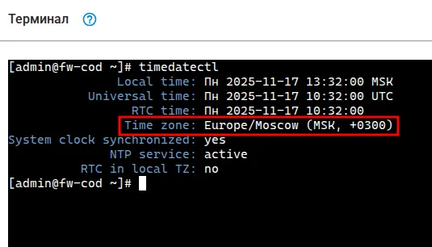

# Модуль 13. Настройка синхронизации времени между сетевыми устройствами
---

## 1. Настройка NTP на cod и a (EcoRouter)

### 1.1 Установка часового пояса

```
cod(config)#ntp timezone utc+7
cod(config)#
```

### 1.2 Настройка NTP-сервера

```
cod(config)#ntp server 100.100.100.100
cod(config)#write memory
Building configuration...
```

### 1.3 Проверка часового пояса

Проверить текущий часовой пояс можно командой `show ntp timezone` из режима администрирования (enable):

```
cod#show ntp timezone
```



### 1.4 Проверка NTP-статуса

Проверить адреса NTP-серверов для синхронизации можно командой `show ntp status` из режима администрирования (enable):

```
cod#show ntp status
```



---

## 2. Настройка NTP на ALT Linux

### 2.1 Установка часового пояса

```bash
timedatectl set-timezone Asia/Novosibirsk
```

### 2.2 Настройка Chrony

Редактируем конфигурационный файл `/etc/chrony.conf`:

```bash
vim /etc/chrony.conf
```

Добавляем/изменяем строку с NTP-сервером:

```
pool 100.100.100.100 iburst
```



### 2.3 Перезапуск службы

```bash
systemctl restart chronyd
```

### 2.4 Проверка синхронизации

Проверяем, с каким сервером синхронизировалось время:

```bash
chronyc tracking
```



### 2.5 Проверка часового пояса

```bash
timedatectl
```



---

## 3. Настройка NTP на firewall (Ideco NGFW)

### 3.1 Вход в веб-интерфейс

Открываем браузер на admin-cod и переходим по адресу:

```
https://192.168.30.254:8443
```

Выполняем вход в веб-интерфейс управления firewall-cod.

### 3.2 Переход в настройки NTP

Переходим: **Сервисы** → **NTP-сервер** и нажимаем **+ Добавить**:



### 3.3 Добавление NTP-сервера

Указываем адрес NTP-сервера `100.100.100.100` и нажимаем **Добавить**:



### 3.4 Результат

Результат успешного добавления NTP-сервера:



### 3.5 Проверка синхронизации через терминал

Открываем терминал в веб-интерфейсе firewall и проверяем синхронизацию:

```bash
chronyc tracking
```



### 3.6 Проверка часового пояса

```bash
timedatectl
```



---

## Следующий модуль

➡️ [Модуль 14. ...](14-....md)
