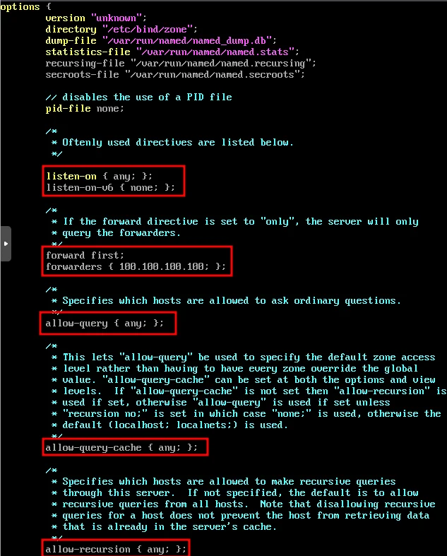
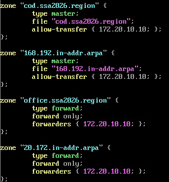
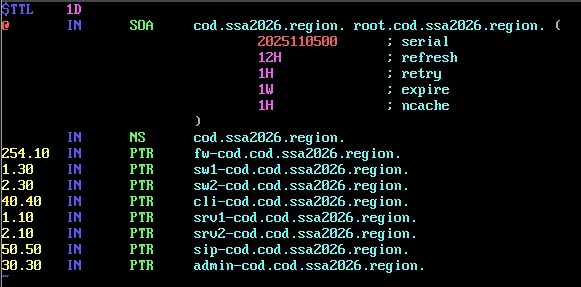
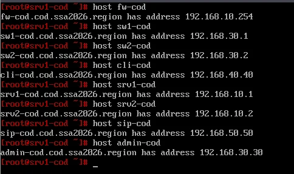
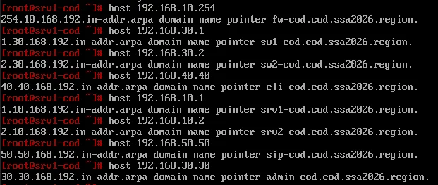
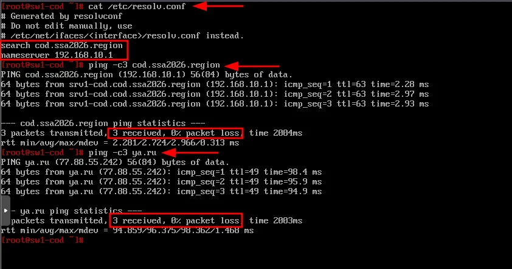
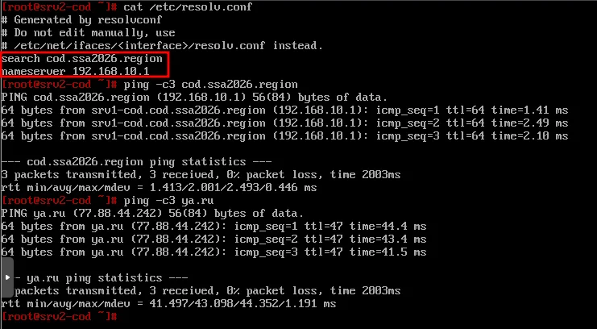

# Модуль 14. Настройка службы доменных имен в COD


---

## 1. Настройка DNS-сервера (srvs1-cod)

### 1.1 Установка BIND

```bash
apt-get install -y bind bind-utils
```

### 1.2 Настройка options.conf

Редактируем конфигурационный файл `/etc/bind/options.conf`:

```bash
vim /etc/bind/options.conf
```
 
Основные параметры:

- **listen-on { any; }** — слушать на всех интерфейсах
- **listen-on-v6 { none; }** — отключить IPv6
- **forward first** — сначала пытаться переслать запрос
- **forwarders { 100.100.100.100; }** — пересылка на ISP
- **allow-query { any; }** — разрешить запросы от всех
- **allow-query-cache { any; }** — разрешить кэширование для всех
- **allow-recursion { any; }** — разрешить рекурсию для всех



### 1.3 Настройка зон в rfc1912.local

Добавить в конфигурационный файл `/etc/bind/rfc1912.local` информацию о файлах зон прямого и обратного просмотра:

```bash
vim /etc/bind/rfc1912.local
```

```
zone "domain" {
    type master;
    file "domain";
    allow-transfer { 172.20.10.10; };
};

zone "168.192.in-addr.arpa" {
    type master;
    file "168.192.in-addr.arpa";
    allow-transfer { 172.20.10.10; };
};

zone "oDomain" {
    type forward;
    forward only;
    forwarders { 172.20.10.10; };
};

zone "20.172.in-addr.arpa" {
    type forward;
    forward only;
    forwarders { 172.20.10.10; };
};
```



>

### 1.4 Создание зоны прямого просмотра

Скопировать файл шаблона:

```bash
cp /etc/bind/zone/localhost /etc/bind/zone/cDomain
```

Выдать права:

```bash
chown root:named /etc/bind/zone/cDomain
```

Редактируем файл `/etc/bind/zone/cDomain`:

```bash
vim /etc/bind/zone/cDomain
```

Содержимое файла зоны прямого просмотра:

```
$TTL    1D
@       IN      SOA     cod.ssa2026.region. root.cod.ssa2026.region. (
                        2025110500      ; serial
                        12H             ; refresh
                        1H              ; retry
                        1W              ; expire
                        1H              ; ncache
                        )

        IN      NS      cod.ssa2026.region.

firewall          IN      A       192.168.10.254
switch1-cod         IN      A       192.168.30.1
switch2-cod         IN      A       192.168.30.2
client-cod         IN      A       192.168.40.40
srvs1-cod        IN      A       192.168.10.1
srvs2-cod        IN      A       192.168.10.2
sips-cod         IN      A       192.168.50.50
admin-cod       IN      A       192.168.30.30
```

### 1.5 Создание зоны обратного просмотра

Скопировать файл шаблона:

```bash
cp /etc/bind/zone/localhost /etc/bind/zone/168.192.in-addr.arpa
```

Выдать права:

```bash
chown root:named /etc/bind/zone/168.192.in-addr.arpa
```

Редактируем файл `/etc/bind/zone/168.192.in-addr.arpa`:

```bash
vim /etc/bind/zone/168.192.in-addr.arpa
```

Содержимое файла зоны обратного просмотра:

```
$TTL    1D
@       IN      SOA     cod.ssa2026.region. root.cod.ssa2026.region. (
                        2025110500      ; serial
                        12H             ; refresh
                        1H              ; retry
                        1W              ; expire
                        1H              ; ncache
                        )

        IN      NS      cod.ssa2026.region.

254.10  IN      PTR     fw-cod.cod.ssa2026.region.
1.30    IN      PTR     sw1-cod.cod.ssa2026.region.
2.30    IN      PTR     sw2-cod.cod.ssa2026.region.
40.40   IN      PTR     cli-cod.cod.ssa2026.region.
1.10    IN      PTR     srv1-cod.cod.ssa2026.region.
2.10    IN      PTR     srv2-cod.cod.ssa2026.region.
50.50   IN      PTR     sip-cod.cod.ssa2026.region.
30.30   IN      PTR     admin-cod.cod.ssa2026.region.
```



### 1.6 Запуск службы BIND

```bash
systemctl enable --now bind
```

### 1.7 Настройка DNS-клиента на srvs1-cod

```bash
cat <<EOF > /etc/net/ifaces/ens19/resolv.conf
search cDomain
nameserver 127.0.0.1
EOF
```

### 1.8 Перезагрузка

```bash
reboot
```

### 1.9 Проверка записей типа A

```bash
host firewall
host switch1-cod
host switch2-cod
host client-cod
host srvs1-cod
host srvs2-cod
host sips-cod
host admin-cod
```



### 1.10 Проверка записей типа PTR

```bash
host 192.168.10.254
host 192.168.30.1
host 192.168.30.2
host 192.168.40.40
host 192.168.10.1
host 192.168.10.2
host 192.168.50.50
host 192.168.30.30
```



---

## 2. Настройка DNS-клиентов

### 2.1 switch1-cod и switch2-cod (ALT Server)

Задаём в качестве DNS-сервера srvs1-cod:

```bash
cat <<EOF > /etc/net/ifaces/mgmt-cod/resolv.conf
search domain
nameserver 192.168.10.1
EOF
```

Перезагружаем службу network:

```bash
systemctl restart network
```

Проверка:

```bash
cat /etc/resolv.conf
ping -c3 
ping -c3 ya.ru
```



### 2.2 srvs2-cod (ALT Server)

Задаём в качестве DNS-сервера srvs1-cod:

```bash
cat <<EOF > /etc/net/ifaces/ens20/resolv.conf
search cDomain
nameserver 192.168.10.1
EOF
```

Перезагружаем службу network:

```bash
systemctl restart network
```

Проверка:

```bash
cat /etc/resolv.conf
ping -c3 domain
ping -c3 ya.ru
```



### 2.3 Остальные устройства COD

Аналогичным образом настраиваются DNS-клиенты на:

| Устройство | Интерфейс | DNS-сервер |
|------------|-----------|------------|
| client-cod | ens19 (или соответствующий) | 192.168.10.1 |
| admin-cod | ens19 (или соответствующий) | 192.168.10.1 |
| sips-cod | eth0 | 192.168.10.1 |

---

➡️ [Модуль 15. ...](15-....md)
