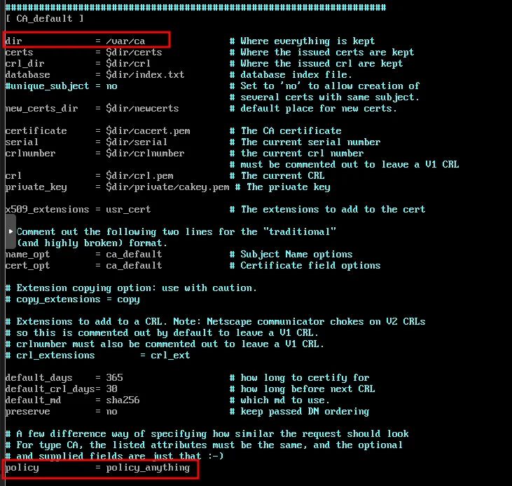
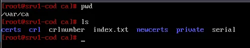
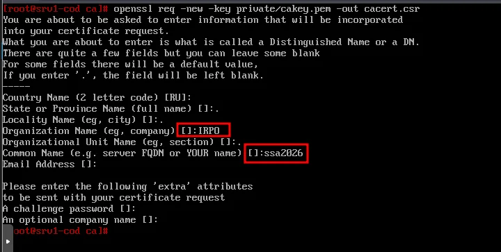
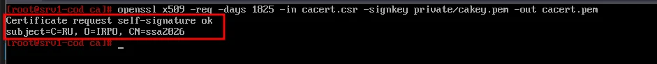
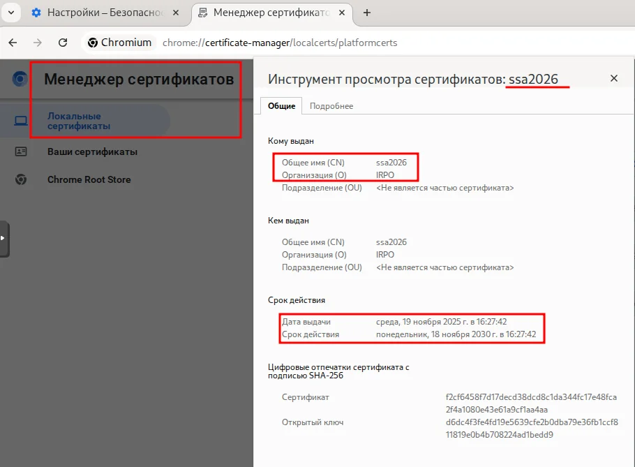
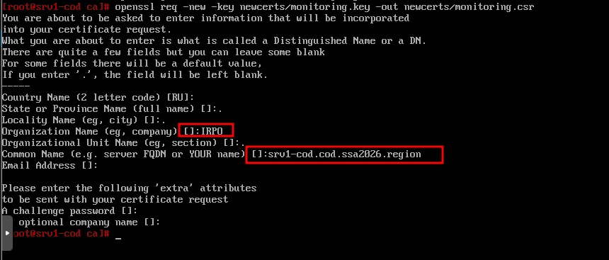
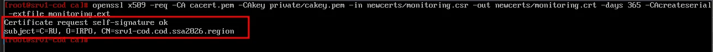
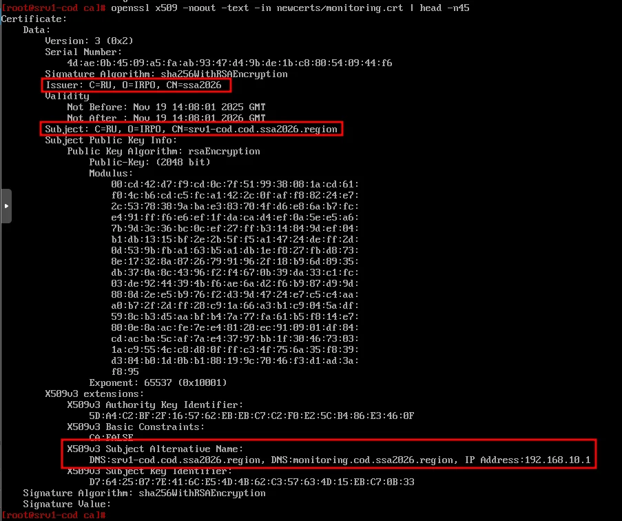

# Модуль 17. Настройка центра сертификации (CA)

[← Назад к оглавлению](../README.md)

---

## 📋 Содержание

* [Описание](#описание)
* [Часть 1: Настройка структуры CA](#часть-1-настройка-структуры-ca)
* [Часть 2: Создание корневого сертификата](#часть-2-создание-корневого-сертификата)
* [Часть 3: Распространение корневого сертификата](#часть-3-распространение-корневого-сертификата)
* [Часть 4: Выпуск сертификата для сервиса мониторинга](#часть-4-выпуск-сертификата-для-сервиса-мониторинга)
* [Проверка](#проверка)

---

## Описание

В данном модуле настраивается собственный центр сертификации (Certificate Authority) на сервере **srvs1-cod** для выпуска SSL/TLS сертификатов для внутренних сервисов.

**Параметры CA:**
| Параметр | Значение |
| --- | --- |
| Сервер CA | srv1-cod |
| Директория CA | /var/ca |
| Организация (O) | IRPO |
| Common Name (CN) | ssa2026 |
| Срок действия корневого сертификата | 5 лет (1825 дней) |
| Срок действия выпускаемых сертификатов | 1 год (365 дней) |

---

## Часть 1: Настройка структуры CA

### srvs1-cod (alt-server)

#### Шаг 1.1: Создание директории CA

```bash
mkdir /var/ca
```

#### Шаг 1.2: Редактирование конфигурации OpenSSL

Отредактируем конфигурационный файл `/etc/openssl/openssl.cnf`:

```bash
nano /etc/openssl/openssl.cnf
```

Внесите следующие изменения в секцию `[ CA_default ]`:



**Ключевые параметры:**
* `dir = /var/ca` — базовая директория CA
* `policy = policy_anything` — менее строгая политика проверки

#### Шаг 1.3: Создание структуры директорий

Перейдите в директорию `/var/ca` и создайте необходимую структуру:

```bash
cd /var/ca
mkdir certs
mkdir crl
mkdir newcerts
mkdir private
touch index.txt
touch serial
touch crlnumber
echo 01 > serial
echo 01 > crlnumber
```

**Результат:**



**Описание структуры:**
| Директория/Файл | Назначение |
| --- | --- |
| `certs/` | Хранение выпущенных сертификатов |
| `crl/` | Списки отозванных сертификатов (CRL) |
| `newcerts/` | Новые сертификаты с уникальными именами |
| `private/` | Приватный ключ CA (cakey.pem) |
| `index.txt` | База данных выданных сертификатов |
| `serial` | Счётчик серийных номеров сертификатов |
| `crlnumber` | Счётчик номеров CRL |

#### Шаг 1.4: Создание приватного ключа CA

```bash
openssl genrsa -out private/cakey.pem
```

---

## Часть 2: Создание корневого сертификата

### srvs1-cod (alt-server)

#### Шаг 2.1: Создание запроса на сертификат (CSR)

```bash
openssl req -new -key private/cakey.pem -out cacert.csr
```

При выполнении команды укажите следующие данные:



**Заполняемые поля:**
| Поле | Значение |
| --- | --- |
| Country Name | RU |
| State or Province Name | . (пусто) |
| Locality Name | . (пусто) |
| Organization Name | **IRPO** |
| Organizational Unit Name | . (пусто) |
| Common Name | **ssa2026** |
| Email Address | . (пусто) |

> ⚠️ **Важно:** Поля Organization Name (IRPO) и Common Name (ssa2026) обязательны для заполнения!

#### Шаг 2.2: Подпись запроса и выпуск корневого сертификата

Подписываем запрос, выпуская самоподписанный корневой сертификат сроком на 5 лет:

```bash
openssl x509 -req -days 1825 -in cacert.csr -signkey private/cakey.pem -out cacert.pem
```

**Результат:**



---

## Часть 3: Распространение корневого сертификата

### srvs1-cod (alt-server)

#### Шаг 3.1: Разрешение SSH доступа для root

Убедитесь, что на srvs1-cod разрешён доступ по SSH для пользователя root.

### client-cod, admin-cod, client1-a, client2-a (alt-workstation)

#### Шаг 3.2: Копирование корневого сертификата

Забираем через scp корневой сертификат и помещаем его в локальное хранилище:

```bash
scp root@srvs1-cod.cDomain:/var/ca/cacert.pem /etc/pki/ca-trust/source/anchors/ca.crt
```

#### Шаг 3.3: Обновление хранилища сертификатов

```bash
update-ca-trust
```

#### Шаг 3.4: Проверка в браузере

Откройте браузер и перейдите в настройки сертификатов:

* **Chromium:** `chrome://certificate-manager/localcerts/platformcerts`



**Проверьте:**
* Common Name (CN): **ssa2026**
* Организация (O): **IRPO**
* Срок действия: 5 лет от даты выпуска

---

## Часть 4: Выпуск сертификата для сервиса мониторинга

### srvs1-cod (alt-server)

#### Шаг 4.1: Переход в директорию CA

```bash
cd /var/ca
```

#### Шаг 4.2: Создание ключа для сертификата мониторинга

```bash
openssl genrsa -out newcerts/monitoring.key
```

#### Шаг 4.3: Создание запроса на подпись (CSR)

```bash
openssl req -new -key newcerts/monitoring.key -out newcerts/monitoring.csr
```



**Заполняемые поля:**
| Поле | Значение |
| --- | --- |
| Organization Name | **IRPO** |
| Common Name | **srvs1-cod.cDomain** |

#### Шаг 4.4: Создание файла расширений

Создайте файл с расширениями для сертификата:

```bash
cat <<EOF > monitoring.ext
authorityKeyIdentifier=keyid,issuer
basicConstraints=CA:FALSE
subjectAltName=@alt_names

[alt_names]
DNS.1=srvs1-cod.cDomain
DNS.2=monitoring.cDomain
IP.1=192.168.10.1
EOF
```

> 
#### Шаг 4.5: Подпись запроса и выпуск сертификата

```bash
openssl x509 -req -CA cacert.pem -CAkey private/cakey.pem -in newcerts/monitoring.csr -out newcerts/monitoring.crt -days 365 -CAcreateserial -extfile monitoring.ext
```



---

## Проверка

### Проверка содержимого сертификата

```bash
openssl x509 -noout -text -in newcerts/monitoring.crt | head -n45
```



**Что проверить:**
* **Issuer:** C=RU, O=IRPO, CN=ssa2026
* **Subject:** C=RU, O=IRPO, CN=srvs1-cod.cDomain
* **X509v3 Subject Alternative Name:**
  * DNS:srvs1-cod.cDomain
  * DNS:monitoring.cDomain
  * IP Address:192.168.10.1

### Проверка соответствия ключа и сертификата

```bash
openssl x509 -noout -modulus -in newcerts/monitoring.crt | md5sum
openssl rsa -noout -modulus -in newcerts/monitoring.key | md5sum
```

>

---

## 📁 Итоговая структура файлов

```
/var/ca/
├── cacert.csr          # Запрос на корневой сертификат
├── cacert.pem          # Корневой сертификат CA
├── cacert.srl          # Серийные номера (создаётся автоматически)
├── monitoring.ext      # Файл расширений
├── certs/
├── crl/
├── crlnumber
├── index.txt
├── newcerts/
│   ├── monitoring.crt  # Сертификат мониторинга
│   ├── monitoring.csr  # Запрос на сертификат
│   └── monitoring.key  # Приватный ключ
├── private/
│   └── cakey.pem       # Приватный ключ CA
└── serial
```

---

## ⚠️ Частые ошибки

| Ошибка | Причина | Решение |
| --- | --- | --- |
| `unable to load certificate` | Неверный путь к файлу | Проверьте путь и имя файла |
| `key values mismatch` | Ключ не соответствует сертификату | Перегенерируйте пару ключ+сертификат |
| `error in extension` | Ошибка в файле расширений | Проверьте синтаксис, особенно `@alt_names` |
| Браузер не доверяет | Корневой сертификат не установлен | Выполните `update-ca-trust` |

---

[← Назад к оглавлению](../README.md)
